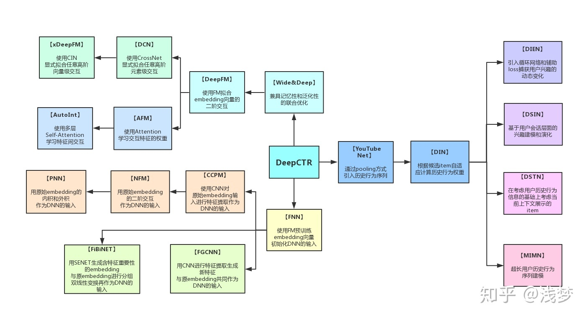
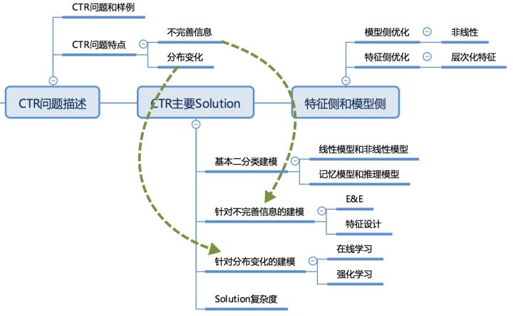
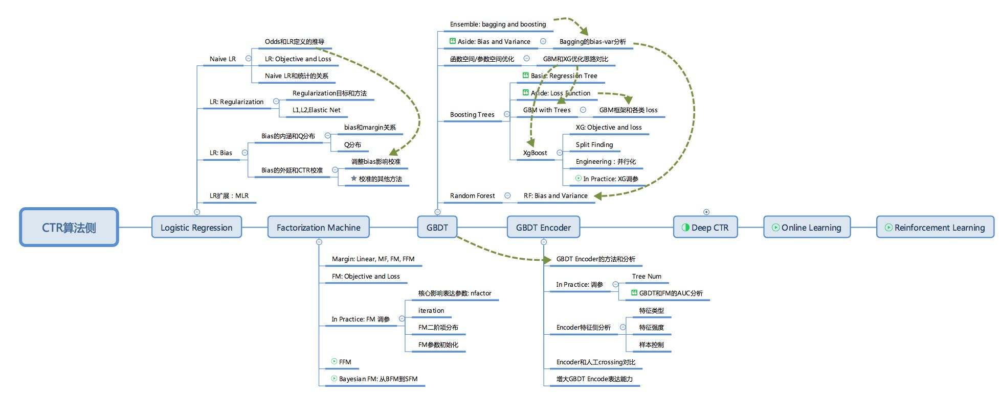

> # CTR-Introduction

Reference:

* [CTR/推荐系统算法模型概述文章汇总](CTR/推荐系统算法模型概述文章汇总)
* [DeepCtr-torch](https://github.com/shenweichen/deepctr-torch)

## Intro

## Model

* 机器学习基础: **[LR](https://link.zhihu.com/?target=https%3A//mp.weixin.qq.com/s/lG0Lg-Ri73-rfQWK8c7hiQ)** / **[LibFM](https://link.zhihu.com/?target=https%3A//mp.weixin.qq.com/s/opo53MfxPg313PvVGiHDHg)** (FM扩展FFM, BFM, SFM)
* 特征交叉: **[DCN](https://link.zhihu.com/?target=https%3A//mp.weixin.qq.com/s/Xe51jeW0GfMt1WRshKfqfw)** / **[PNN](https://link.zhihu.com/?target=https%3A//mp.weixin.qq.com/s/1KIAXq5uAgbrkiUOqzN-nA)** / **[DeepMCP](https://link.zhihu.com/?target=https%3A//mp.weixin.qq.com/s/JAucfJuk-sV9kV_UwLBZhg)** / **[xDeepFM](https://link.zhihu.com/?target=https%3A//mp.weixin.qq.com/s/yNEv1hFzRHQ3BMrENimypg)** / **[FiBiNet](https://link.zhihu.com/?target=https%3A//mp.weixin.qq.com/s/cCR9wcquV2f0TDcBnNkzSQ)** / **[AFM](https://link.zhihu.com/?target=https%3A//mp.weixin.qq.com/s/5FFkZJI8TxPXlbiTtYKj6Q)**
* CNN: CCPM, FGCNN
* 用户行为建模: **[DSIN](https://link.zhihu.com/?target=https%3A//mp.weixin.qq.com/s/f1FJTQdCgKnfQ2LxwIzTRA)** / **[DMR](https://link.zhihu.com/?target=https%3A//mp.weixin.qq.com/s/3fOQcs91T8hp4vvZ4CaZMg)** / **[DMIN](https://link.zhihu.com/?target=https%3A//mp.weixin.qq.com/s/Pfd_w2HxVziNNUCLFnGALw)** / **[DIN](https://link.zhihu.com/?target=https%3A//mp.weixin.qq.com/s/j6ac63_1AJvkiRyjjv_63Q)**
* 多任务建模: **[MMOE](https://link.zhihu.com/?target=https%3A//mp.weixin.qq.com/s/qn38VYu87KPDCw3xFN_6eQ)**
* Graph 建模: **[GraphSage](https://link.zhihu.com/?target=https%3A//mp.weixin.qq.com/s/zNfUCE1wotfLEqJkqL8NHA)** / **[GAT](https://link.zhihu.com/?target=https%3A//mp.weixin.qq.com/s/_ZPJl3fS-bl4xtm0KaCOdQ)**

