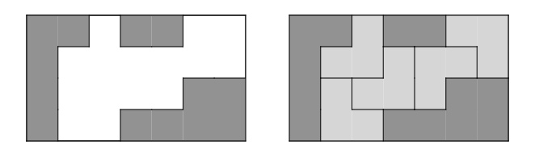

> # ALGOSPORT-BOARDCOVER （DFS + 组合计数）

link: https://algospot.com/judge/problem/read/BOARDCOVER

#### Problem




There is a game board in H*W size. The board has a grid of black and white squares, and I want to cover all the white squares with 3 L-shaped blocks. Blocks can be freely rotated and placed at this time, but must not overlap, cover black squares, or leave the board. The picture above shows a board and how to cover it.

Write a program that counts the number of ways to cover a game board given it.


#### input


The first line of the output is given the number of test cases C (C <= 30). The first line of each test case is given two integers H, W (1 <= H,W <= 20) . Each W letter on the next H line gives the shape of the board. `#`indicates a black field, `.`and indicates a white field. The number of white squares on the board given as input does not exceed 50.


#### Print


Prints the number of ways to cover all white cells, one per line.


#### example input

```
3 
3 7 
#.....# 
#.....#
##...## 
3 7
#.....#
#.....#
##..### 
8 10 
########## 
#........# 
#........#
#........#
#........#
#........#
#........#
##########
```

#### Example output

```
0
2
1514
```

-----

盖板的形式如果采取相对坐标，就只有四种形式，为了避免重复，选择每次都从所有空白格最左上方开始进行覆盖。

```c++
#include <bits/stdc++.h>

using namespace std;

vector<vector<vector<int>>> coverType {
	{{0, 0}, {1, 0}, {1, 1}},
	{{0, 0}, {0, 1}, {1, 0}},
	{{0, 0}, {0, 1}, {1, 1}},
	{{0, 0}, {1, 0}, {1, -1}}
};
const int maxLine = 25;
vector<string> grid(maxLine);
const char blank = '.';

int m, n;


bool canSet(int x, int y, int typeIndex) {
	bool flag = true;
	for (auto & vec : coverType[typeIndex]) {
		int tmpX = x + vec[0];
		int tmpY = y + vec[1];
		if (tmpX < 0 || tmpX >= m || tmpY < 0 || tmpY >= n || grid[tmpX][tmpY] != blank) {
			flag = false;
			break;
	}
	}

	return flag;
}

void setCover(int x, int y, int typeIndex, char ch) {
	for (auto & vec : coverType[typeIndex]) {
		int tmpX = x + vec[0];
		int tmpY = y + vec[1];
		grid[tmpX][tmpY] = ch;
	}
}


int DFS() {
	int startX = -1, startY = -1;
	for (int i = 0; i < m; ++i) {
		for (int j = 0; j < n; ++j) {
			if (grid[i][j] == blank) {
				startX = i, startY = j;
				break;
			}
		}
		if (startX != -1) break;
	}

	if (startX == -1) return 1;
	int cnt = 0;
	for (int i = 0; i < coverType.size(); ++i) {
		if (canSet(startX, startY, i)) {
			setCover(startX, startY, i, '#');
			cnt += DFS();
			setCover(startX, startY, i, blank);
		}
	}

	return cnt;
}


bool isValid() {
	int whiteNum = 0;
	for (int i = 0; i < m; ++i) {
		for (int j = 0; j < n; ++j) {
			if (grid[i][j] == blank) ++whiteNum;
		}
	}

	return whiteNum % 3 == 0 && whiteNum != 0;
}


int main() {
    std::ios_base::sync_with_stdio(false);
    cin.tie(NULL);
    cout.tie(NULL);


    int caseNum; cin >> caseNum;
    while (caseNum--) {
    	cin >> m >> n;
    	for (int i = 0; i < m; ++i) {
    		cin >> grid[i];
			grid[i] = grid[i].substr(0, n);
    	} 
    	if (! isValid()) cout << 0 << endl;
    	else {
    		int res = DFS();
			cout << res << endl; 
    	}
    }


    return 0;
}

```

